# 🏭 GNR-VAL v5.2 — Industrial CAD Compliance Validator

**Varroc Eureka 3.0 · Problem Statement 9**

[](https://gnr-val-cad-validator-demo.streamlit.app/)
[](https://python.org)
[](https://pytorch.org)
[](https://streamlit.io)

> TransformerConv GNN + ISO 2768 / ASME Y14.5 / GD&T / DFM Rule Engine

---

## Table of Contents
- [About](#about)
- [Live Demo](#live-demo)
- [Features](#features)
- [Model Performance](#model-performance)
- [Screenshots](#screenshots)
- [Demo Videos](#demo-videos)
- [Tech Stack](#tech-stack)
- [Local Setup](#local-setup)
- [Project Structure](#project-structure)

---

## About

**GNR-Val v5.2** is an AI-powered industrial CAD compliance validator built for **Varroc Eureka 3.0 (PS-9)**. It combines a **Graph Neural Network (TransformerConv GNN)** with a deterministic **ISO/ASME rule engine** to validate CAD component designs for manufacturing compliance — automatically classifying them as **Compliant**, **Review-Needed**, or **Non-Compliant**.

The system uses a **fusion decision architecture** where ML predictions and rule-based severity scores are combined into a single **Fused Risk Score**, with safety overrides for critical violations.

---

## Live Demo

**Live App:** [https://gnr-val-cad-validator-demo.streamlit.app/](https://gnr-val-cad-validator-demo.streamlit.app/)

No installation required — try it directly in your browser!

---

## Features

| Feature | Description |
|---|---|
| 🧠 GNN Validator | TransformerConv GNN with edge-aware encoding for component graph analysis |
| 📐 Rule Engine | ISO 2768, ASME Y14.5, GD&T, DFM compliance checks |
| 🔗 Fusion Scoring | ML + Rule Engine fused risk score with safety override logic |
| 📂 STEP File Upload | Parse real CAD .STEP/.STP files directly |
| 🎲 Random Demo | Generate 20 synthetic components instantly for testing |
| 📊 Model Analytics | Live accuracy, precision, recall, F1 + confusion matrix |
| 📄 Export Reports | Download compliance reports as .TXT or .JSON |
| 🏢 Multi-Org Support | Configurable organisation and product context |

---

## Model Performance

| Metric | Score |
|---|---|
| Accuracy | 98.68% |
| Precision (Macro) | 98.94% |
| Recall (Macro) | 98.52% |
| F1 Score (Macro) | 98.7% |

### Model Architecture

| Component | Details |
|---|---|
| Encoder | 3x TransformerConv (edge-aware, edge_dim=2) |
| Dims | 128 to 128 to 64 |
| Decoder | Autoencoder (latent to 8) |
| Classifier | 64 to 32 to 16 to 3 |
| Total Params | 116,971 |
| Standards | ISO 2768, ASME Y14.5, GD&T, DFM |

---

## Screenshots

### Main Interface — Component Geometry Input
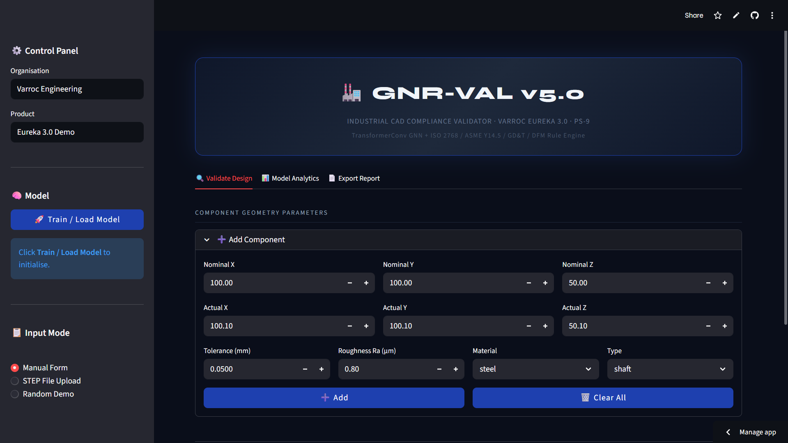

### Model Analytics — GNN Performance Dashboard
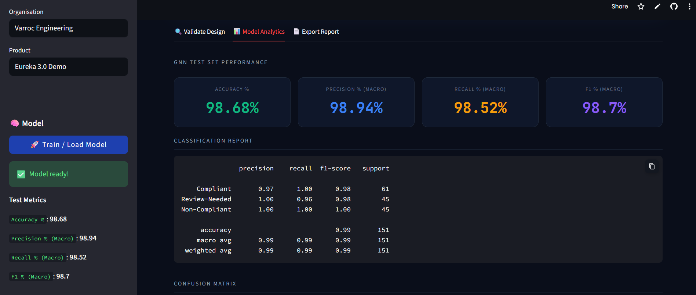

### Confusion Matrix
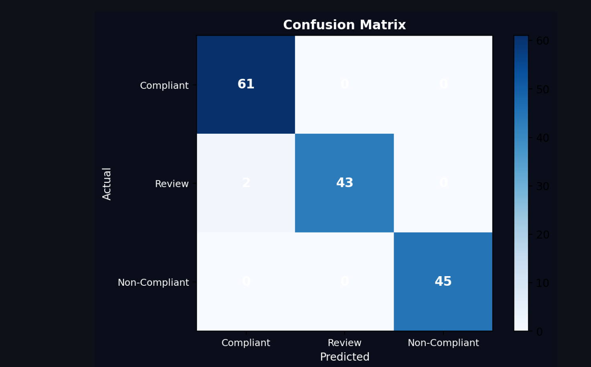

### Model Architecture Details
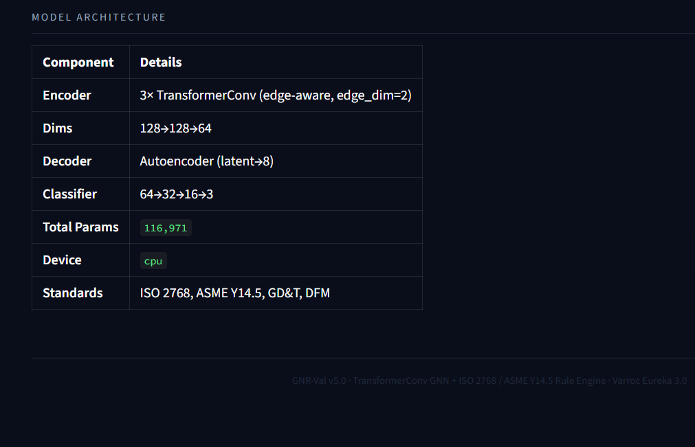

### STEP File Upload Mode
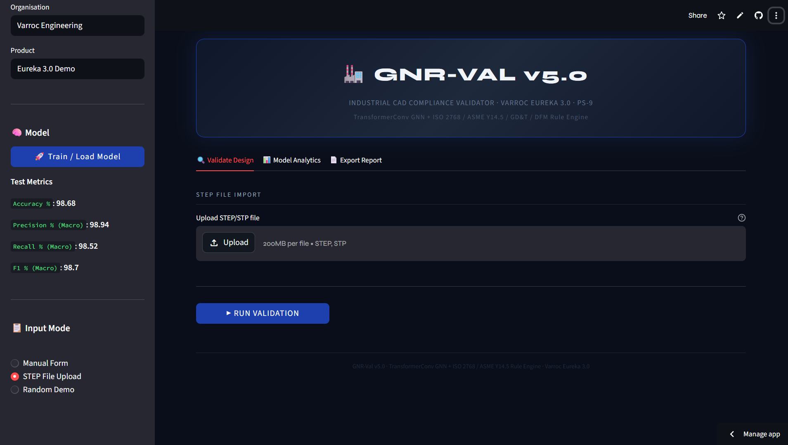

### Random Demo Mode (20 Synthetic Components)
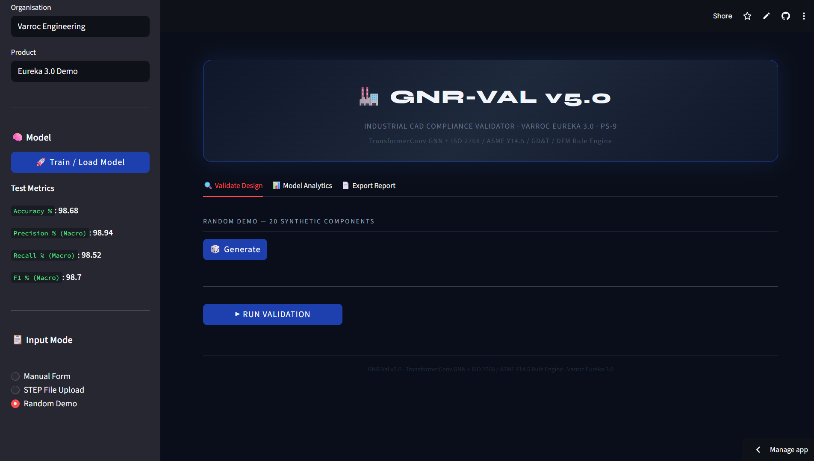

### Compliance Report Preview
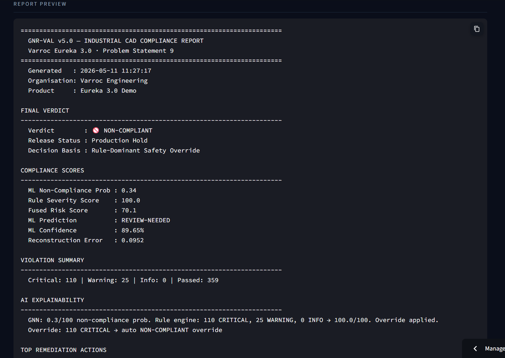

### Violation Log + Export Options
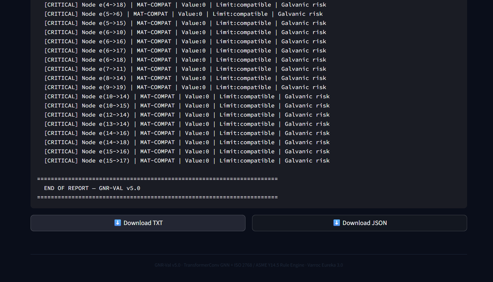

---

## Demo Videos

### Demo 1 — Manual Form Validation
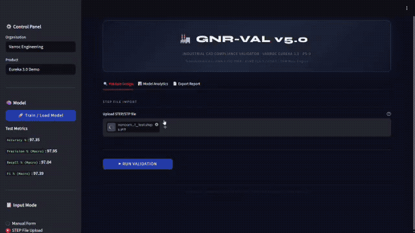

### Demo 2 — Model Analytics and Confusion Matrix
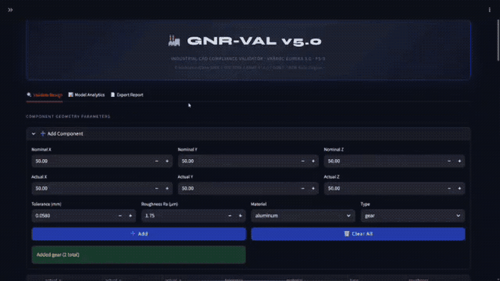

### Demo 3 — Random Demo and Export Report
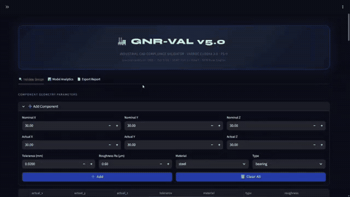

---

## Tech Stack

```
GNR-Val v5.2
├── ML Framework      → PyTorch + PyTorch Geometric (TransformerConv GNN)
├── Graph Processing  → NetworkX
├── Rule Engine       → Custom ISO 2768 / ASME Y14.5 / GD&T / DFM engine
├── Fusion Layer      → ML + Rule score weighted fusion (fusion.py)
├── Frontend          → Streamlit
├── Visualization     → Plotly, Matplotlib, Seaborn
└── Data              → Pandas, NumPy, Scikit-learn
```

---

## Local Setup

### Option 1 — Automated Script
```bash
git clone https://github.com/adityadev00/GNR-Val-CAD-Validator.git
cd GNR-Val-CAD-Validator
chmod +x setup_gnrval.sh
./setup_gnrval.sh
```

### Option 2 — Manual
```bash
git clone https://github.com/adityadev00/GNR-Val-CAD-Validator.git
cd GNR-Val-CAD-Validator
pip install -r requirements.txt
streamlit run app.py
```

### Requirements
- Python 3.10+
- See requirements.txt for packages
- Models gnrval_final_combined.pt and gnrval_real_trained.pth are included in repo

---

## Project Structure

```
GNR-Val-CAD-Validator/
├── app.py
├── fusion.py
├── EurekaPS9__3_.ipynb
├── gnrval_final_combined.pt
├── gnrval_real_trained.pth
├── requirements.txt
├── setup_gnrval.sh
├── assets/
└── README.md
```

---

## Competition Context

Built for **Varroc Eureka 3.0** — Problem Statement 9 (PS-9).

GNR-Val treats CAD assemblies as **graphs**, applies GNN-based learning for pattern recognition, and layers deterministic engineering rules on top for safety-critical override decisions.

---

**GNR-Val v5.2 · TransformerConv GNN + ISO 2768 / ASME Y14.5 Rule Engine · Varroc Eureka 3.0**

Made with love by [adityadev00](https://github.com/adityadev00)
